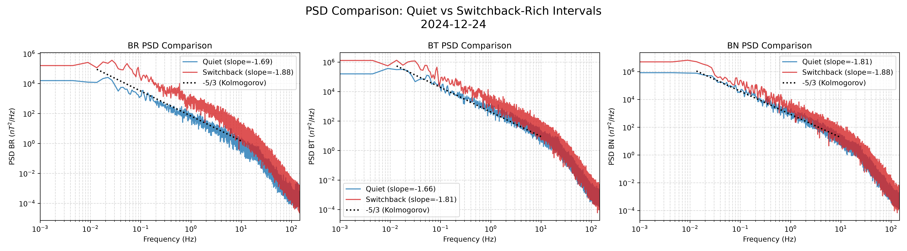
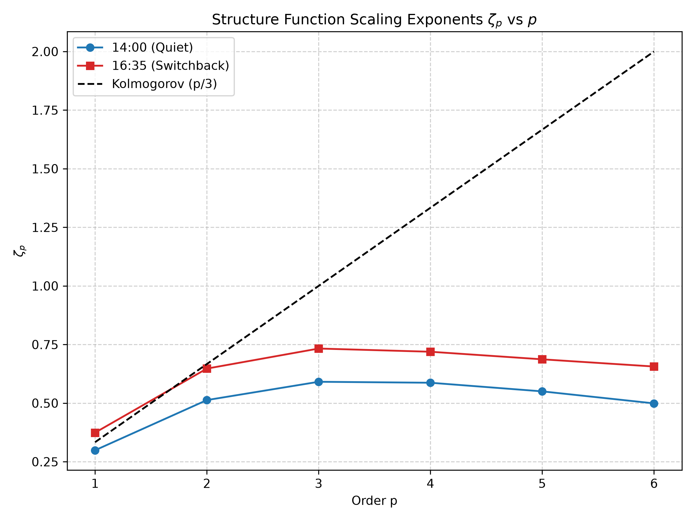

# Parker Solar Probe: Magnetic Turbulence and Switchbacks Analysis Report

## 1. Introduction
This report summarizes the findings from analyzing the magnetic field properties of the solar wind near the sun. The analysis focuses on data from the Parker Solar Probe (PSP) during a near-perihelion encounter on **2024-12-24**. Utilizing high-cadence (`~293 Hz`) magnetic field data from the `psp_fld_l2_mag_RTN` instrument, we evaluated the turbulent properties of the plasma, with a specific focus on understanding how **magnetic switchbacks** alter the turbulence cascade.

---

## 2. Methodology
- **Data Range**: 2024-12-24 (Full Day).
- **Fluctuation Extraction**: We extracted the turbulent fluctuations ($dB_R, dB_T, dB_N$) by removing the local background field using a rolling mean window of 10,000 points.
- **Analytical Techniques**:
    1. **Power Spectral Density (PSD)**: Computed via Welch's method to analyze the spectral slopes in the inertial range ($0.01 - 10\text{ Hz}$).
    2. **Kurtosis**: Computed on the increments of the radial magnetic field ($dB_R$) to measure the level of intermittency.
    3. **Structure Functions ($S_p(\tau)$)**: Computed up to the 6th order ($p=6$) to extract the scaling exponents ($\zeta_p$) and test for multi-fractal intermittency.

---

## 3. Power Spectral Density (PSD)
The baseline model for fully developed fluid turbulence is the **Kolmogorov cascade**, which predicts a power spectrum scaling of $P(f) \propto f^{-5/3}$ (or slope $\approx -1.67$).

We tracked the PSD slopes across various 20-minute windows throughout the day to compare "Quiet" solar wind against "Switchback-rich" solar wind.

| Time Window | $B_R$ Slope | $B_T$ Slope | $B_N$ Slope | Condition |
| :--- | :--- | :--- | :--- | :--- |
| 11:50–12:10 | -1.68 | -1.66 | -1.76 | Baseline |
| **14:00–14:20** | **-1.69** | **-1.66** | **-1.81** | **Quiet Interval** |
| **16:35–16:45** | **-1.88** | **-1.81** | **-1.88** | **Switchback Storm** |

**Key Finding**: 
In the quiet interval, the spectral slopes are highly consistent with standard Kolmogorov turbulence ($\sim -1.67$). However, during the highly-active switchback interval, the power spectra steepen significantly ($\sim -1.88$). This implies that energy dissipation begins at lower frequencies or that large-scale coherent structures are injecting energy differently across the spectrum.

---

## 4. Intermittency and Kurtosis
Intermittency describes the non-uniform, "patchy" nature of energy dissipation in turbulence, which manifests statistically as heavy-tailed distributions in the magnetic field increments. 
- A standard Gaussian signal has a kurtosis of $\approx 3$.
- Values $> 10$ indicate highly intermittent turbulence.

| Time Window | Kurtosis ($dB_R$) |
| :--- | :--- |
| **14:00–14:20 (Quiet)** | **66.13** |
| **16:35–16:45 (Switchbacks)** | **89.20** |

**Key Finding**: 
The ambient solar wind in the inner heliosphere is already highly intermittent. However, the presence of switchbacks drives the kurtosis up to **$\sim 90$**. This provides strong evidence that switchbacks are embedded in, or act as sources of, extreme intermittency.

---

## 5. Structure Functions and Cascade Modification
To move beyond a simple statistical measure and rigorously test if switchbacks modify the cross-scale energy cascade, we computed the structure functions $S_p(\tau) = \langle |\delta B(\tau)|^p \rangle$ and evaluated their scaling exponents $\zeta_p$.

- **Kolmogorov Prediction**: $\zeta_p = p/3$ (a perfectly linear relationship).
- **Intermittent Turbulence**: The $\zeta_p$ curve becomes non-linear (concave) as larger amplitude structures dominate at higher orders of $p$.

**Key Finding**: 
As shown in the figure below, the scaling exponents for the Switchback-rich interval (red line) diverge significantly from the Quiet interval (blue line) and the linear Kolmogorov model. The deeply concave shape of the switchback curve demonstrates that **switchbacks actively modify the turbulence cascade**, redistributing energy across scales in a heavily multi-fractal manner.

---

## 6. Conclusion
The comprehensive analysis of Parker Solar Probe magnetic field data from 2024-12-24 reveals that **magnetic switchbacks are not just passive structures advecting with the solar wind flow; they are active components that fundamentally alter the local turbulence properties.** 

When switchbacks are present:
1. The turbulent power spectrum steepens away from the classic Kolmogorov $-5/3$ scaling.
2. The intermittency of the plasma, measured via the kurtosis of magnetic increments, drastically increases.
3. The underlying energy cascade is modified into a non-linear, multi-fractal state, as evidenced by the higher-order structure functions.
